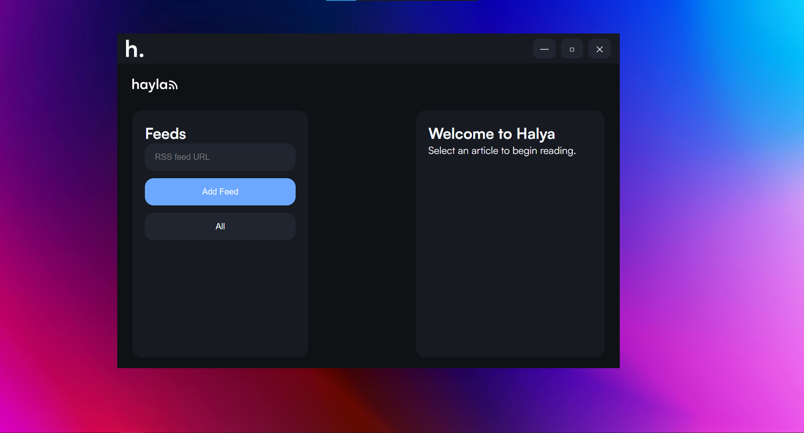

# Halya

> A minimal, modern RSS reader built for speed, simplicity, and knowledge.


## About

Halya is a lightweight RSS feed reader designed to make keeping up with information simple.

It focuses on:

* Clean, distraction-free reading
* Local-first storage
* Fast startup
* A modern interface
* User control over feeds and data

No accounts. No tracking. Just your feeds.

## Features

### Current

* ✅ RSS feed support
* ✅ Atom feed support
* ✅ Add and remove feeds
* ✅ Article reader view
* ✅ Read/unread tracking
* ✅ Local storage
* ✅ Custom window controls
* ✅ WebView2 desktop application

### Planned

* 🔲 Feed categories
* 🔲 Search
* 🔲 Better article formatting
* 🔲 Import/export feeds via OPML
* 🔲 Settings panel
* 🔲 Themes
* 🔲 Offline caching

## Screenshots



## Install

There are 2 ways to install Halya.
### **With** .NET

If you haven't already, grab the .NET SDK from Microsoft [here.](https://dotnet.microsoft.com/en-us/download)

Download the ```net``` install .exe from our [Releases Page.](https://github.com/0CTOGON/Halya/releases)

Follow the instructions provided.

### **Without** .NET (reccomended)

Download the ```nonet``` install .exe from our [Releases Page.](https://github.com/0CTOGON/Halya/releases)

Follow the instructions provided.

## Technology

Halya uses:

* C#
* .NET 8
* Windows Forms
* Microsoft WebView2
* HTML/CSS/JavaScript

## Contributing

Contributions are welcome!

Before making large changes, please open an issue or discussion first.

## License

Halya is licensed under the Apache License 2.0.

See `LICENSE` for details.

## Branding

The Halya name, logo, and official branding are protected.

Forks and modifications must not present themselves as the official Halya project without permission.

---

Made with curiosity and code.
